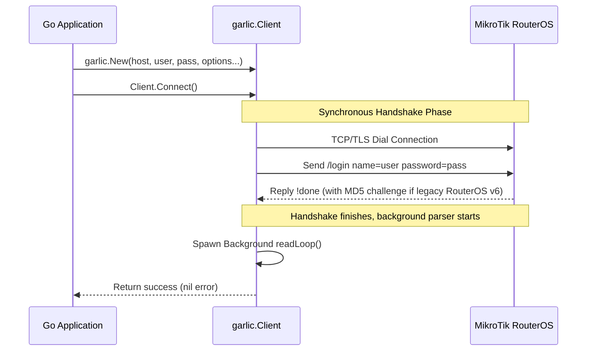
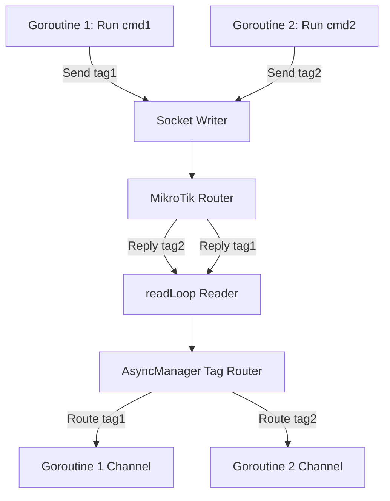

<p align="center">
  
</p>

<h1 align="center">garlic-client — Developer Documentation</h1>

<p align="center">
  Detailed guide, architecture, and API usage references for the Go RouterOS API Client.
</p>

---

## Architecture Overview

`garlic-client` is designed to be highly concurrency-safe, performant, and memory-efficient. Instead of blocking the client thread during network operations, it uses a background multiplexer goroutine.

### 1. Connection Flow


---

## API Reference

### 1. Initialization
Create a client instance using functional options:
```go
client, err := garlic.New("167.99.9.95", "admin", "password", 
	garlic.WithPort(9001), 
	garlic.WithTimeout(5*time.Second),
)
```

#### Available Options:
- **`WithTLS()`**: Connect securely via TLS (defaults to port `8729`).
- **`WithPort(port int)`**: Override host address port with a custom port.
- **`WithTimeout(d time.Duration)`**: Custom TCP/Handshake timeout.

---

### 2. Command Runner API

#### Dynamic Command Builder
Create commands using a fluent API styled like raw RouterOS commands:
```go
cmd := garlic.NewCommand("/ip/address/print").
	Filter("disabled", "false").
	Proplist("address", "interface")
```

#### Synchronous Execution: `Run()`
Executes the command and blocks until all `!re` replies are returned:
```go
replies, err := client.Run(cmd)
for _, reply := range replies {
	fmt.Println("IP:", reply.Map["address"])
}
```

#### Single Row Execution: `RunOne()`
Useful for commands where you only expect one response item:
```go
reply, err := client.RunOne(garlic.NewCommand("/system/identity/print"))
fmt.Println("Identity:", reply.Map["name"])
```

#### Asynchronous Execution: `RunAsync()`
Runs a command concurrently and returns a channel to read replies on-the-fly:
```go
ch, err := client.RunAsync(cmd)
for reply := range ch {
	if err := reply.AsError(); err != nil {
		log.Println("Error:", err)
		break
	}
	log.Println("Received item:", reply.Map["name"])
}
```

---

## Concurrency Safety & Multiplexing

The client supports running **multiple queries simultaneously** over a single TCP socket. Each query registers a unique `.tag` via `asyncManager`:



### Safety Features:
- **Panic Protection**: The background reader loop recovers from panics if a corrupted sentence is read, safely closing the connection instead of crashing the process.
- **Non-blocking Dispatch**: If a goroutine is slow to read from an async channel, the tag router automatically drops the blocked listener to prevent stalling the entire socket multiplexer.
